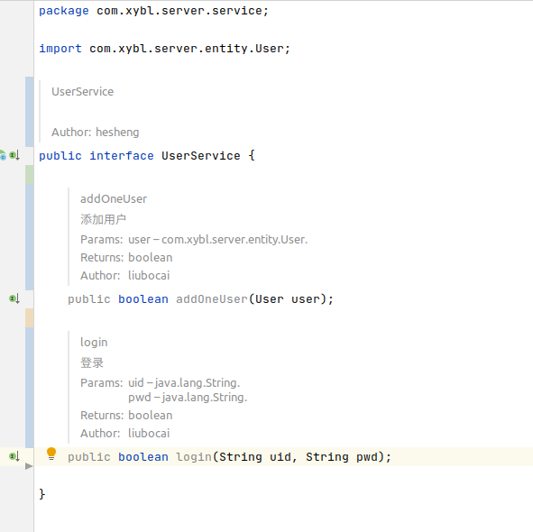

# XYBL_server

## 数据库说明
### user
1. id varchar(32) primary key
   * 用户id。
   * 格式为：RyyyyMMddHHmmssZZXXXX。21位。
     * R: 角色。1位。
     * yyyyMMddHHmmss: 注册时间。14位。
     * ZZ: 区域。2位。
     * XXXX: 当天注册序号。4位。
   * 实际有效id字长为21位。
   * **生成id可调用UserUtil.genId(int role, int zone, int last_id).**详情查看函数声明。
2. name varchar(32)
3. pwd varchar(32)
4. role int(1)
   * 用户角色（权限）。
   * 暂定9为普通学生。
   * 其他待定。
5. email varchar(32)
6. tel varchar(16)


## javadoc template

### live template

**settings-->Editor-->Live Template**

1. 添加template group。如下图所示。


2. 添加live template。如下图所示。


3. 定义使用范围。点击define，打开如下图所示页面，勾选everywhere。


4. 编辑template。包括快捷指令（Abbreviation）和Tempalte text。如下图所示。

   ```text
   ##classdesc。（不要复制这一行）
   **
    * $name$
    * <p></p>
    * @author $user$
    * @create $date$
    **/
   ```

   ```text
   ##funcdes。（不要复制这一行）
   **
   * $name$
   * <p></p>
   $param$
   * @return $return$
   * @author $author$
   * @create: $date$
   */
   ```

   

5. edit variables

   

   

   ```
   groovyScript("def result=''; def params=\"${_1}\".replaceAll('[\\\\[|\\\\]|\\\\s]', '').split(',').toList(); def types=\"${_2}\".replaceAll('[\\\\[|\\\\]|\\\\s]','').split(',').toList(); for(i = 0; i < params.size(); i++) { result+='* @param ' + params[i] + ' ' + types[i] + '. ' + ((i < params.size() - 1) ? '\\n ' : '') };return result", methodParameters(),methodParameterTypes()) 
   ```

   

### File and Code Templates

找到class。加入注释模板。如图所示。

```
/**
 * ${NAME}
 * <p></p>
 * @author ${USER}
 * @create ${DATE}
 **/
```


### 使用

1. live template：

   * /classdesc+Enter

     

   * /fundes+Enter

     

   * 

2. File and Code Templates:

   new class时自动调用模板。


