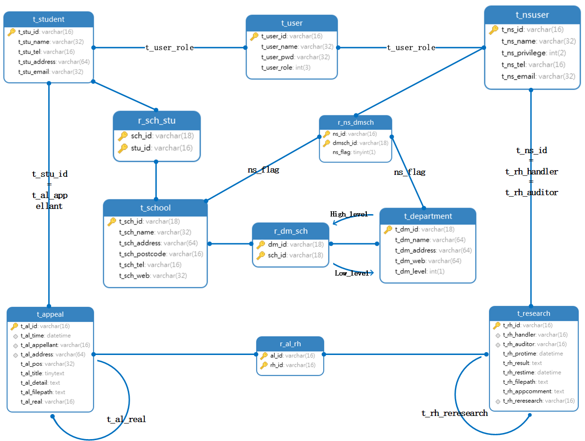
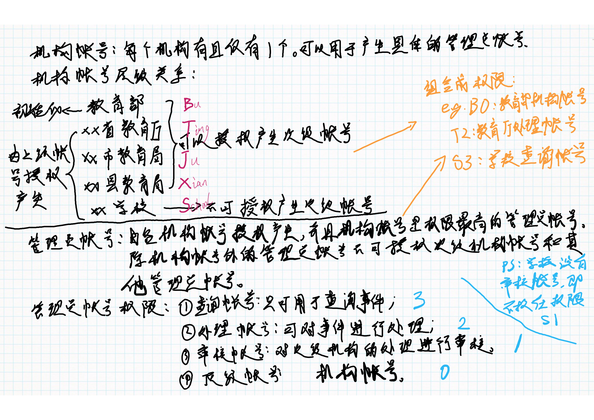

# 数据库定义

## to do

- [x] 【db】【md】表**t_school**和表**t_department**的id字段长度变更。-->~~表**t_user**的id变更~~，关系**r_sch_stu**、**r_ns_dmsch**、**r_dm_sch**的相关id字段长度的变更。
- [x] ~~【db】【md】更改表**t_appeal**的**t_al_appellant**字段长度。~~
- [x] ~~【db】【md】更改表**t_research**的**t_rh_handler**和**t_rh_auditor**字段长度。~~
- [x] 【db】【server】更改关系**r_ns_dmsch**的**ns_flag**字段类型、长度。
- [x] 【server】【md】表**t_user**的id生成。
- [x] ~~【server】【md】表**t_student**的id生成。~~
- [x] ~~【server】【md】表**t_nsuser**的id生成。~~
- [ ] 【server】【md】表**t_appeal**的id生成。
- [ ] 【server】【md】表**t_research**的id生成。
- [ ] 【server】【md】文件接收、存储、发送的方法。
- [x] 【md】表**t_nsuser**的**t_ns_privilege**字段含义待定。
- [x] 【md】表**t_department**的**t_dm_level**字段含义待定。

## 数据库结构概览

> 修正说明：
>
>  	①表t_user的**t_user_role**字段类型为tinyint，长度为1位；
>
> ​	②表t_nsuser的**t_ns_privilege**字段类型为varchar，长度为2位；
>
> ​	③表t_department的**t_dm_level**的类型为varchar，长度为1位。

## 表

### t_user

* 说明：用户表。主要用于登录功能。

* 字段：

  * **t_user_id**: varchar(16). 用户id。

    * 实际长度： 16位。

    * 构成：【13位】unix时间戳（ms级）+【3位】当天(last_id+1)。

      > 说明：当last_id+1=1000时，id=0. 其他表id生成过程做相同处理。

    * 相关方法：待定。

  * **t_user_name**: varchar(32). 用户昵称。

     > 特别说明：出于对举报人的信息保密的需求，此处的用户名为昵称。

  * **t_user_pwd**: varchar(32). 用户密码。

  * **t_user_role**: tinyint(1). 区分用户角色。此字段地不同值指向不同的用户表。
  
     * 含义：0代表*student*，1代表*ns_user*

### t_student

* 说明：学生信息表。***此表的用户通过个人主动注册而来。***

* > 特别说明：用户注册时至少需要提供tel或email其中之一用于注册。

* 字段：

  * **t_stu_id**: varchar(16). 学生id。

    > 说明：同**t_user**的id字段。

  * **t_stu_name**: varchar(32). 学生姓名，*真名*。

  * **t_stu_tel**: varchar(16). 电话。

  * **t_stu_address**: varchar(64). 地区。

     >  说明：格式化的地区信息。如：湖北省，武汉市，洪山区

  * **t_stu_email**: varchar(32). 邮箱。

### t_nsuser

* 说明：非学生用户信息表。***此表的用户通过由上而下地授权产生。***
* 字段：
  * **t_ns_id**: varchar(16). 用户id。

    > 说明：同**t_user**的id字段。

  * **t_ns_name**: varchar(32). 用户名称。

  * **t_ns_privilege**: varchar(2). 用户权限。
    
    * 含义：如图。
    * 构成：【1位】机构代码+【1位】管理员权限代码。
    
    
    
* **t_ns_tel**: varchar(16). 电话。
  
  * **t_ns_email**: varchar(32). 邮箱。

### t_school

* 说明： 学校信息表。
* 字段：
  * **t_sch_id**: varchar(18). 学校id。
    * 实际长度：***<u>18位。</u>***
    * 构成：统一社会信用代码。详情参考[GB 32100-2015](http://www.gb688.cn/bzgk/gb/newGbInfo?hcno=24691C25985C1073D3A7C85629378AC0)。
  * **t_sch_name**: varchar(32).  学校名称。
  * **t_sch_address**: varchar(64). 学校地址。
  * **t_sch_postcode**: varchar(16). 学校邮编。
  * **t_sch_tel**: varchar(16). 学校联系电话。
  * **t_sch_web**: varchar(32). 学校官网。

### t_department

* 说明：部门信息表。
* 字段：
  * **t_dm_id**: varchar(18). 部门id。
    * 实际长度：***<u>18位。</u>***
    * 构成：统一社会信用代码。详情参考[GB 32100-2015](http://www.gb688.cn/bzgk/gb/newGbInfo?hcno=24691C25985C1073D3A7C85629378AC0)。
  * **t_dm_name**: varchar(64). 部门名称。
  * **t_dm_address**: varchar(64). 部门办事所在地。
  * **t_dm_web**: varchar(64). 部门官网。
  * **t_dm_level**: varchar(1). 部门层级。

    > 分为四级。教育部（B）、XX省教育厅（T）、XX市教育局（J）、XX县教育局（X）。

### t_appeal

* 说明：举报表。

* 字段：

  * **t_al_id**: varchar(16). 举报id。

    * 实际长度：16位。
    * 构成：【13位】unix时间戳（ms级）+【3位】当天（last_id+1）
    * 相关方法：待定。

  * **t_al_time**: datetime. 提交举报的时间。

  * **t_al_appellant**: varchar(16). 举报者id。

  * **t_al_address**: varchar(64). 区域。

     > 说明：存储格式为格式化后的区域信息。如：湖北省，武汉市，洪山区

  * **t_al_pos**: varchar(32). 定位。经纬度。

  * **t_al_title**: tinytext. 标题。（摘要）

  * **t_al_detail**: text. 详情。

  * **t_al_filepath**: text. 附件上传至服务器后的本地存储路径。

    > 说明：①相对路径。②格式如下：path/to/file1,path/to/file2。③其他附件做相同处理。

  * **t_al_real**: varchar(16). 是否二次举报。
  
     > 说明：未二次举报时，此项为空。二次举报后，此项为补充举报信息的id。

### t_research

* 说明：调查处理表。

* 字段：

  * **t_rh_id**: varchar(16). 处理的id。

    * 实际长度：16位。
    * 构成：【13位】unix时间戳（ms级）+【3位】当天（last_id+1)。
    * 相关方法：待定。

  * **t_rh_handler**: varchar(16). 处理的nsuser的id。

  * **t_rh_auditor**: varchar(16).审核的nsuser的id。

  * **t_rh_protime**: datetime. 受理时间。

  * **t_rh_reesult**: text. 处理结果。

  * **t_rh_restime**: datetime. 提交处理结果时间。

  * **t_rh_filepath**: text. 附件上传至服务器后的本地存储路径。

  * **t_rh_appcomment**: text. 举报人对于处理结果的意见。

  * **t_rh_reresearch**: varchar(16). 是否二次举报。

    > 说明：二次举报未受理之前此项为空，受理后此项为二次受理的处理的id。

## 关系

### r_sch_stu

* 说明：学校-学生关系表。
* 字段：
  * sch_id: varchar(18). 学校id。
  * stu_id: varchar(16). 学生id。

### r_ns_dmsch

* 说明：学校/部门-非学生用户关系。
* 字段：
  * ns_id: varchar(16). nsuser id。
  * dmsch_id: varchar(18). 学校/部门id。
  * ns_flag: tinyint(1). 指明类型是学校还是部门。

### r_dm_sch

* 说明：上级部门-下级部门、部门-学校关系表。
* 字段：
  * dm_id: varchar(18). 上级部门id。
  * sch_id: varchar(18). 下级部门或学校id。

### r_al_rh

* 说明：处理-举报关系。
* 字段：
  * al_id: varchar(16). 举报id。
  * rh_id: varchar(16). 处理id。